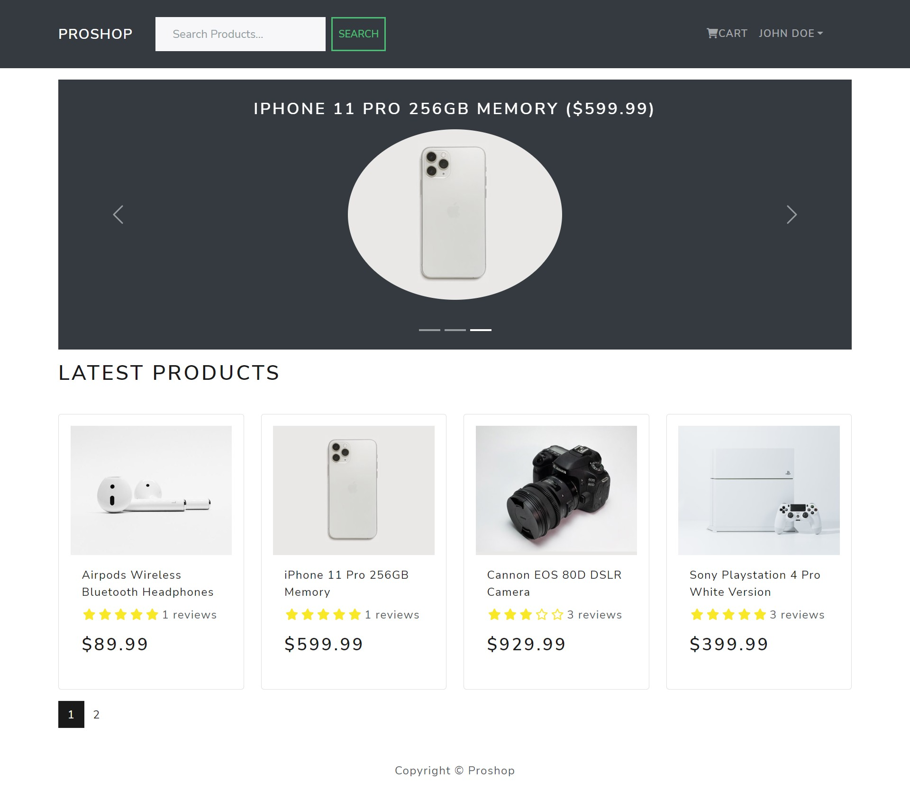

# ProShop - eCommerce Platform 

## Introduction
ProShop is an E-Commerce application where the customers can discover products, shop around using a cart, and then check out.

Link to deployed application - https://test5356624.herokuapp.com

## Features
* Full featured shopping cart
* Products carousel
* Products pagination
* Products search feature
* Products reviews and ratings
* Products and users management for admin
* Order details page for admin
* Mark orders as delivered option
* PayPal / credit card integration

## Tools used
* Frontend development : ReactJS, Redux, React Bootstrap
* Backend development : NodeJS, Express
* Database : MongoDB
* IDE : Visual Studio Code
* Version Control : GitHub
